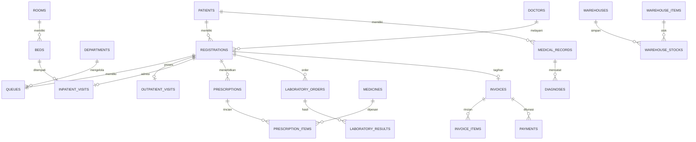

# Diagram Entity-Relationship (ERD) SIMRS Enterprise

Dokumen ini menyajikan gambaran diagram ERD tekstual Mermaid untuk memvisualisasikan relasi entitas inti pada sistem SIMRS Enterprise.

---

## 📐 Diagram ERD Relasi Utama (Mermaid)

