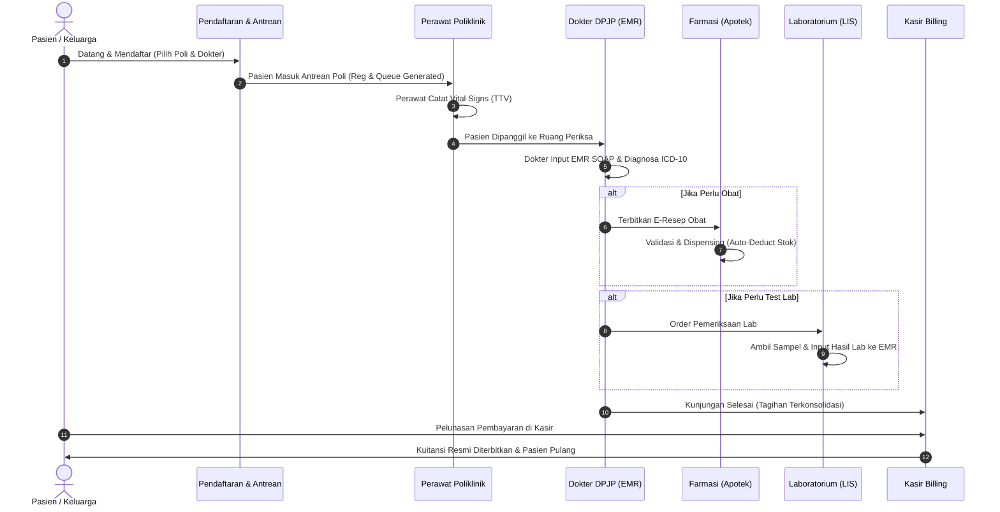

# Alur Pelayanan Pasien (Workflow End-to-End)

Dokumen ini memetakan alur bisnis operasional terintegrasi pasien dari pendaftaran hingga penyelesaian billing pada **SIMRS Enterprise**.

---

## 🔄 Diagram Alur Pelayanan Pasien (Mermaid)

---

## 📌 Penjelasan Rincian 7 Tahap Alur

1. **Tahap 1: Pendaftaran & Antrean**: Generasi nomor registrasi (`REG-`) dan tiket antrean.
2. **Tahap 2: Vital Signs (TTV)**: Perawat mencatat Tensi, Suhu, Nadi, Respirasi, TB, BB, SpO2.
3. **Tahap 3: Pemeriksaan Dokter & EMR**: Dokter mengisi SOAP, menentukan kode ICD-10, dan membuat order penunjang.
4. **Tahap 4: Penyiapan & Dispensing Obat**: Apoteker memproses E-Resep, memverifikasi stok obat, dan menyerahkan obat.
5. **Tahap 5: Pengujian Laboratorium**: Analis mengambil sampel, menguji, dan memasukkan hasil lab langsung ke EMR pasien.
6. **Tahap 6: Konsolidasi Tagihan (Billing)**: Sistem menghitung total otomatis (Registrasi + Dokter + Obat + Lab).
7. **Tahap 7: Pelunasan Kasir & Kuitansi**: Kasir menerima pembayaran dan mencetak kuitansi resmi A4.
